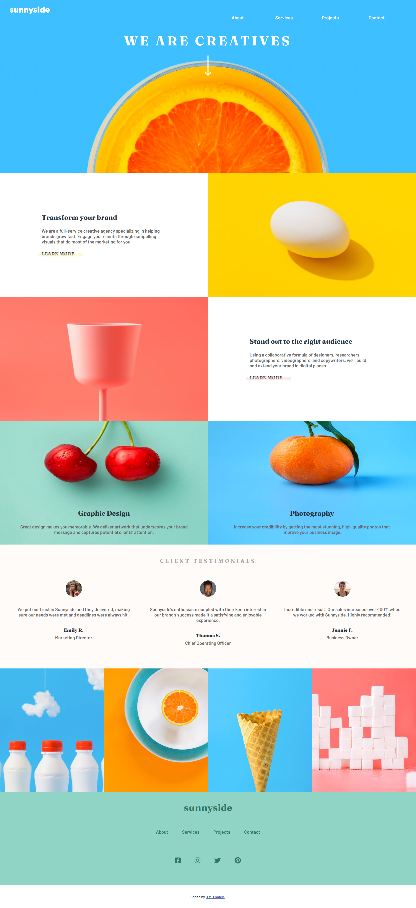

## Table of contents

- [Overview](#overview)
  - [The challenge](#the-challenge)
  - [Screenshot](#screenshot)
  - [Links](#links)
- [My process](#my-process)
  - [Built with](#built-with)
  - [What I learned](#what-i-learned)
  - [Continued development](#continued-development)
  - [Useful resources](#useful-resources)
- [Author](#author)

## Overview

### The challenge

Users should be able to:

- View the optimal layout for the site depending on their device's screen size
- See hover states for all interactive elements on the page

### Screenshot

### Links
- Solution URL: [https://github.com/activus-d/sunnyside-agency-landing-page-main](https://github.com/activus-d/sunnyside-agency-landing-page-main)
- Live Site URL: [https://activus-d.github.io/sunnyside-agency-landing-page-main/](https://activus-d.github.io/sunnyside-agency-landing-page-main/)

## My process

### Built with

- Semantic HTML5 markup
- CSS custom properties
- CSS Grid
- vanilla JavaScript

### What I learned
- was able to play more with the grid layout
- was able to play more with the mobie navigation bar

### Continued development
Need to practice more with grid and page resposiveness

### Useful resources

- [Mobile Navigation Bar](https://www.w3schools.com/howto/howto_js_sidenav.asp) - This helped me undersyand how to make the mobile nav bar hidden

## Author

- Blog - [D.M. Oladele](https://activuscode.hashnode.dev/)
- Twitter - [@activus_d](https://twitter.com/activus_d)

